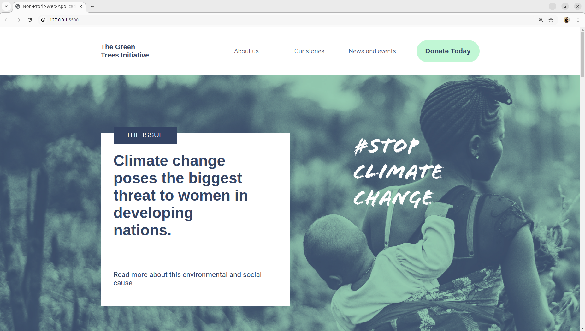

# Responsive Front-End Website

## [Visit the project](https://euphonious-churros-ebd5d0.netlify.app/)

A fully responsive front-end website that includes multiple pages, including a **Home** page, an **About Us** page, and a **Donation Form**. The website is designed to adapt to different screen sizes, making it suitable for mobile, tablet, and desktop views.

## Features
- **Home Page**: The main landing page with a welcoming message and key information.
- **About Us Page**: A page to introduce the organization and its mission.
- **Donation Form**: A user-friendly form for donations with responsive elements.
- **Responsive Design**: The layout automatically adjusts for various screen sizes, providing a seamless experience across devices.
- **Modern Styling**: Clean, visually appealing design with modern CSS practices (e.g., Flexbox, Grid, and Media Queries).

## Technologies Used
- **HTML5**: Structure of the pages.
- **CSS3**: Styling and responsiveness.
- **Media Queries**: Ensures that the website looks great on all screen sizes.
- **Font Awesome**: For icons used across the website.

